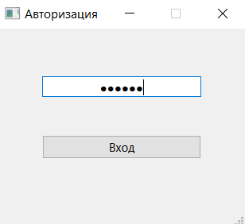
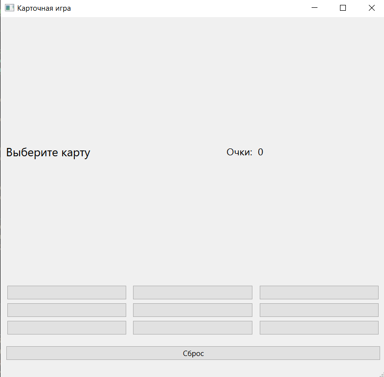
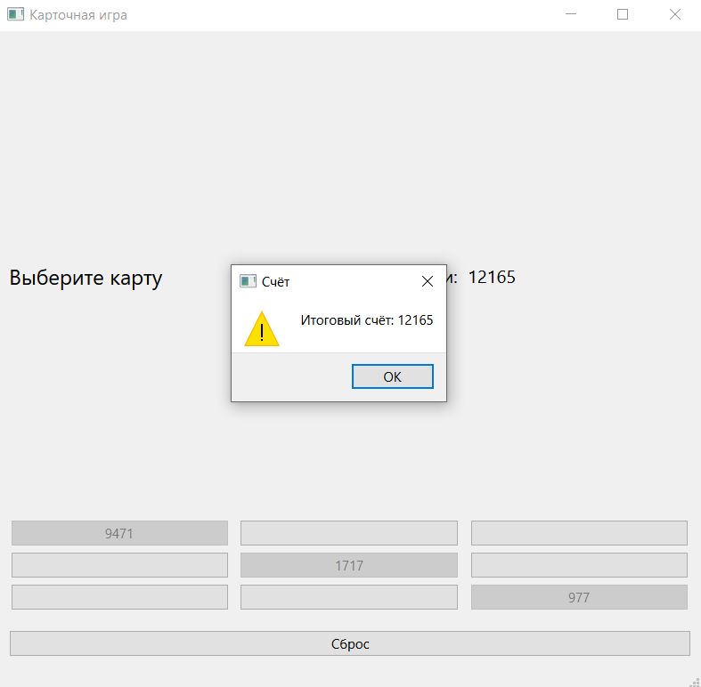

# 191-331_Yakimovskaya

## Название

Игровое приложение "Карточная игра".

## О создании приложения

Основными функциями приложения является рандомная генерация карточек и подсчёт суммы выпавших пользователю трёх значений.

Пользователь может выбрать на своё усмотрение три любые карточки из имеющихся девяти. В правом верхнем углу экрана он будет видеть промежуточную сумму выпавших карточек. После открытия трёх карточек финальная сумма выводится во всплывающем окне. Также есть возможность сбросить имеющиеся карточки и сгенерировать новые путём нажатия на кнопку "Сброс" внизу экрана.

Написано на C++ и QML в Qt Creator.

Дата создания приложения: 25 июня 2022 г.

### Сайт Московского политеха.

https://mospolytech.ru/

## Снимки приложения

